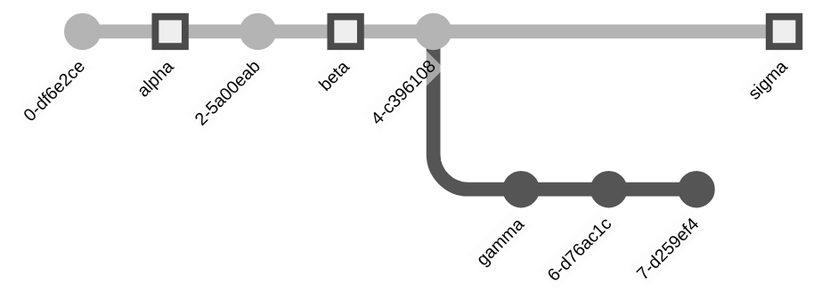
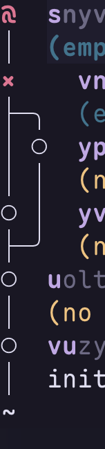
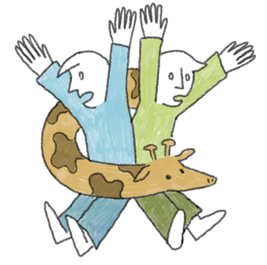
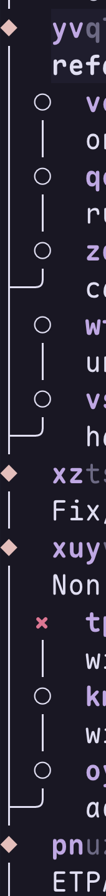

---
theme:
  name: catppuccin-frappe
  override:
    footer:
      style: template
      left:
        image: ./assets/jj.png
      center: '**Introduction** to _Jujutsu_'
      right: "{current_slide} / {total_slides}"
      height: 3
    palette:
      classes:
        noice:
          foreground: "FF8C00"
---
<!-- no_footer -->
<!-- newlines: 6 -->


<!-- alignment: center -->
**Introduction** to <span class="noice">_Jujutsu_</span>

<!-- alignment: center -->

## <span class="noice">_**Thomas Fisker Christensen**_</span>

<!-- end_slide -->

<!-- no_footer -->
<!-- newlines: 6 -->


<!-- alignment: center -->
**Introduction** to <span class="noice">_Jujutsu_</span>

<!-- alignment: center -->

## <span class="noice">_**Thomas Fisker Christensen**_</span>

<!-- end_slide -->

# WHAT IS <span class="noice">_Jujutsu_</span>?

<!-- newlines: 6 -->

- it is a powerful version control system for software projects.
- initially developed by _Martin von Zweigbergk_ (@ Google)
  - now part of the jj-vcs org on github
- used at Google, being rolled out for _General Availability_ in [the beginning of 2026](https://www.youtube.com/watch?v=v9Ob5yPpC0A) for their monorepo
  - Google use a different backend (not git)

<!-- end_slide -->

# <span class="noice">_Jujutsu_</span>'s FIVE BIG IDEAS

<!-- newlines: 6 -->

- automatic snapshotting 🎰
- atomatic rebasing ♻️
- anonymous first 🎭
- first class conflicts ⚠️
- pluggable backend 

<!-- end_slide -->

# AUTOMATIC SNAPSHOTTING

- everything is always "checked" in (no dirty copy)
  - means you are always free to move around
  - everything is always comitted
    - way of storing your changes
    - not necessarily ready to share (free to return to it and refine later)
  - every (non-ignored) file is always added
  - _undeniably simpler_™
    - contrast with git:
      - branch (naming is hard)
      - stage before commit
      - commit (naming is hard)

<!-- end_slide -->

# AUTOMATIC REBASING

<!-- jump_to_middle -->

> constantly in the middle of an interactive rebase



<!-- end_slide -->

# ANONYMOUS FIRST

<!-- jump_to_middle -->

- _**branches**_:
  - name when you are ready to share with others
- _**changes/commits**_:
  - describe when you are sure should how you want to "tell your story"

<!-- end_slide -->

# FIRST CLASS CONFLICTS

<!-- column_layout: [1, 5] -->
<!-- column: 0 -->



<!-- column: 1 -->

- conflicts are stored in your tree and can be solved later
- in one go or in many smaller attempts
- stored in commits
  - the inputs to the merge
  - cheap to recalculate what a conflict is
    - re-evaluate if it has been resolved
- jump around and do the work and resolve conflicts when it suits you
  - contrast: in git conflicts are "🚨stop the world🚨" events 😢

<!-- end_slide -->

# aside


<!-- alignment: center -->
[mergiraf](https://mergiraf.org/)
  
resolving conflicts at 60 km/h

<!-- end_slide -->

# [mergiraf](https://mergiraf.org/)

## Language semantics guided merge tool 🪄✨
  
- Rust (`*.rs`)
- Javascript (`*.js, *.jsx, *.mjs`), TypeScript (`*.ts, *.tsx`)
- C/C++ (`*.c, *.h, *.cc, *.hh, *.cpp, *.hpp, *.cxx, *.hxx, *.c++, *.h++, *.mpp, *.cppm, *.ixx, *.tcc`)
- C# (`*.cs`)
- Python (`*.py`)

Supported out of the box in _Jujutsu_:

```bash
jj resolve --tool mergiraf
```

<!-- end_slide -->


<!-- end_slide -->


<!-- end_slide -->


<!-- end_slide -->

<!-- jump_to_middle -->
<!-- alignment: center -->

back to _Jujutsu_
<!-- end_slide -->

# PLUGGABLE BACKEND

- all the backends
  - "google"
  - git

<!-- jump_to_middle -->
- git is everywhere
- <span class="noice">_Jujutsu_</span> is transparent to others _(git users)_
- git has "ok"-ish UX

<!-- end_slide -->

# Stockholm syndrome? 🇸🇪 🫎

<!-- jump_to_middle -->
> a _psychological_ coping mechanism where **hostages** or **abuse victims** develop _positive feelings_, _empathy_, or even _loyalty_ toward their **captors** or **abusers**

- who here uses **vanilla** commandline git󰊢?
  - **(without any aliases or helper scripts)**?
- blink twice if you are being held against your will 😉

<!-- end_slide -->

# WHAT I LOVE ❤️ _FLUIDITY OF MOVING AROUND_ 🪾

- try different approaches, capture them all in _VCS_ (not just in editor undo history)
<!-- list_item_newlines: 1 -->
- branch 
- squash 🥒
- split 🪓
- abort ❌
- rearrange 
- rebase 󰡓
- edit 
- duplicate 
<!-- list_item_newlines: 2 -->
- leads to **fearless** _iteration/experimentation_ 🧪⚗️
  - without ever getting in the way ❤️🙏

<!-- end_slide -->

# REWRITING HISTORY - HERECY 🧙

<!-- column_layout: [1, 4] -->

<!-- column: 0 -->



<!-- column: 1 -->

<!-- jump_to_middle -->

> accountants don't use erasers

- immutable vs mutable commits
- [configurable](https://docs.jj-vcs.dev/latest/config/#set-of-immutable-commits) to suit your needs

<!-- end_slide -->

# JJ VERSUS STASHING 🧺

<!-- jump_to_middle -->

- git stashes are extremely linear
- <span class="noice">_Jujutsu_</span>'s fluidity and constant snapshotting replace the whole concept

<!-- end_slide -->

# 🙈 UNDO EVERYTHING ⏪

- `jj undo`
- `jj oplog`
- contrast with git:
  - `git reset`
    - hard, soft, mixed
  - `git reflog`

<!-- end_slide -->

# demo


<!-- alignment: center -->

with help from `jj` and [`jjui`](https://github.com/idursun/jjui)

<!-- end_slide -->

# LINK DUMP

<!-- include: links.md -->
